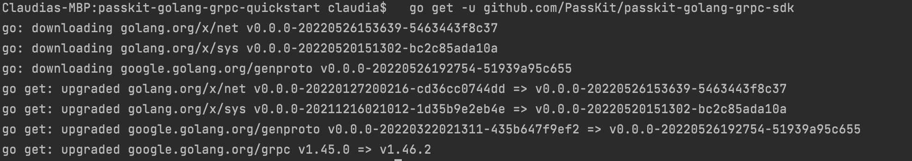

PassKit Golang Quickstart
=======================

### Overview

This quickstart aims to help  get Golang developers up and running with the PassKit SDK as quickly as possible.

### Prerequisites

You will need the following:
- A PassKit account (signup for free at [PassKit](https://app.passkit.com))
- Your PassKit SDK Credentials (available from the [Developer Tools Page](https://app.passkit.com/app/account/developer-tools))
- Apple wallet certificate id (for flights only, available from the [certificate page](https://app.passkit.com/app/account/certificates))
 
- Recommended code editor [Golang](https://go.dev/dl/) (Guide to [installation](https://go.dev/doc/install))

### Configuration

1. Install PassKit Golang SDK in the terminal with `go get -u github.com/PassKit/passkit-golang-grpc-sdk` 
It should output something similar to below:

2. In the certs folder of the repository add the following three PassKit credential files:
    - certificate.pem
    - ca-chain.pem
    - key.pem
    
    You can disregard the key-java.pem credentials file as it is not compatible with Golang.

3. Now we need to decrypt your `key.pem`. At your project root directory in the terminal, run `cd ./certs`  `openssl ec -in key.pem -out key.pem`. If you are in your root directory the terminal should show `PASSKIT-GOLANG-GRPC-QUICKSTART` to the left of the cursor and then after running the command `certs`, as shown below.

For the password use the one-time password that you used for generating the SDK credentials.

Your `key.pem` file should look like below.
   
   If you do not see `Proc-Type: 4,ENCEYPTED` on line 2, you have successfully decrypted `key.pem`.
   
4. Replace `YOUR_EMAIL_ADDRESS@EMAIL.COM` in `main.go` on line 29 with your email address in order to receive the welcome email with card url which your member will also receive.

5. Go back to root directory with `cd ../`. Then run `go mod tidy` , then `go run main.go` to create a sample membership card, coupon card and boarding pass (with default templates & tiers/offers) and issue them. If you are in your root directory the terminal should show `PASSKIT-GOLANG-GRPC-QUICKSTART` to the left of the cursor.

## Examples
###  Membership Cards
#### Issue A Membership Card.
Follow the steps of the configuration to get the quickstart up and running.
In `IssueMembershipCard()` the methods there are:
- CreateProgram() - takes a new program name and creates a new program
- CreateTier() -  takes the programId of the program just created in the above program, creates a new template (based of default template), creates a tier, and links this tier to the program
- EnrolMember() - takes programId and tierId created by the above methods, and memberDetails, creates a new member record, and sends a welcome email to deliver membership card url

After running `go run main.go` the terminal should show:

#### Engage With Your Members
`EngageWithMembers()` contains multiple methods you can use to engage with your members. They use the information from `IssueMembershipCard()` to run the methods unless information is manually entered.
- GetSingleMember() - takes memberId and returns the record of that member
- ListMembers() - takes search conditions as pagination object and returns list of member records which match with the conditions
- CountMembers() - takes search conditions as pagination object and returns the number of members who match with the condition
- SendWelcomeEmail() - takes memberId and sends a welcome email (contains membership card url) to the member
- UpdateMember_EmailAddress() - takes memberId and memberDetails, and updates existing member record
- AddPoints() - takes a programId of an existing program and memberId of existing member to add points to chosen member
- UsePoints() - takes a programId of an existing program and memberId of existing member to use points from a chosen member
- DeleteMembers() - takes programId, tierId, memberId and memberDetails, deletes an existing member record

After running `go run main.go` the terminal should show:

###  Coupons
#### Issue A Coupon.
Follow the steps of the configuration to get the quickstart up and running.
In `IssueCoupon()` the methods are:
- CreateCampaign() - takes a new campaign name and creates a new campaign
- CreateOffer() - takes a campaignId of the campaign you just created and creates a new template (based of default template), creates an offer, and links this offer to the campaign
- CreateCoupon() - takes campaignId and offerId created by the above methods, and couponDetails, creates a new coupon record, and sends a welcome email to deliver coupon card url

After running `go run main.go` the terminal should show:

#### Engage With Coupons.
`EngageWithCoupons()` contains multiple methods you can use to engage with coupons. They use the information from `IssueCoupon()` to run the methods unless informatin is manually entered.
- GetSingleCoupon() - takes couponId and returns the record of that coupon
- ListCoupons() - takes search conditions as pagination object and returns list of coupon records which match with the conditions
- CountCoupons() - takes search conditions as pagination object and returns the number of coupons who match with the condition
- UpdateCoupon() - takes a campaignId of an existing campaign and couponId of existing coupon to update that coupon
- RedeemCoupon() - takes a campaignId of an existing campaign and couponId of existing coupon to redeem that coupon
- VoidCoupon() - takes the couponId, offerId and campaignId to void an existing coupon
- DeleteCouponOffer() - takes the offerId to delete an existing offer

After running `go run main.go` the terminal should show:

### Boarding Passes
#### Issue A Boarding Pass.
Follow the steps of the configuration to get the quickstart up and running.
In `IssueBoardingPass()` the methods are:
- CreateTemplate() - creates the pass template for flights and boarding passes
- CreateCarrier() - takes a new carrier code and creates a new carrier
- CreateAirport() - takes a new airport code and creates a new airport.
- CreateFlight() - takes templateId , from previous method, to use as base template and uses a carrier code, created from previous method, and creates a new flight
- CreateFlightDesignator() - creates flight designator using flight code
- CreateBoardingPass() - takes templateId, from previous method, and customer details creates a new boarding pass, and sends a welcome email to deliver boarding pass url

After running `go run main.go` the terminal should show:

#### Engage With Boarding Passes.
`EngageWithBoardingPass()` contains multiple methods you can use to engage with boarding passes. They use the information from `IssueBoardingPass()` to run the methods unless informatin is manually entered.
- DeleteFlight() - takes an existing flight number as well as other details and deletes the flight associated with it
- DeleteFlightDesignator() - takes an existing flight designation and deletes the flight designator associated with it
- DeleteAirports() - takes an existing airport code and deletes the airport associated with it
- DeleteCarrier() - takes an existing carrier code and deletes the carrier associated with it

After running `go run main.go` the terminal should show:

## GUI Tool
GUI tool can be accessed from [your PassKit account](https://app.passkit.com/login).

## Documentation
* [PassKit Membership Official Documentation](https://docs.passkit.io/protocols/member)
* [PassKit Coupons Official Documentation](https://docs.passkit.io/protocols/coupon)
* [PassKit Boarding Passes Official Documentation](https://docs.passkit.io/protocols/boarding)

## Getting Help
* [Online chat support](https://passkit.com/)

## License
Distributed under MIT License. Details available on [license file](#).
